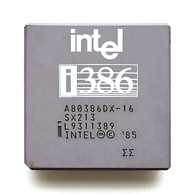

    	<font size="10"> <b>Golfer - Part 1<b></font>

​		21<sup>th</sup> 5 2024

​		Challenge Author(s): 
   0xNinja
​		

 


### Description:

A friend gave you an odd executable file, in fact it is very tiny for a simple ELF, what secret can this file hide?


### Difficulty: `easy`

### Flag: `HTB{y0U_4R3_a_g0lf3r}`


# Solver

We can use the ```file``` command to provide an overview of the file type.

  

With a little bit of research the file  is written in x86 assembly language, specifically targeting the Intel 32-bit architecture (also known as i386)

 

Let's open the program in IDA.

```assembly
 0800004C                 public start
  0800004C start                                  
  0800004C                 jmp     start_0
  08000051 ; ---------------------------------------------------------------------------
  08000051                 inc     bl
  08000053                 inc     dl
  08000055                 mov     ecx, 800000Ah
  0800005A                 call    loc_800012F
  0800005F                 mov     ecx, offset byte_8000008
  08000064                 call    loc_800012F
  08000069                 mov     ecx, offset dword_8000024
  0800006E                 call    loc_800012F
  08000073                 mov     ecx, 800000Eh
  08000078                 call    loc_800012F
  0800007D                 mov     ecx, 800000Ch
  08000082                 call    loc_800012F
  08000087                 mov     ecx, 8000023h
  0800008C                 call    loc_800012F
  08000091                 mov     ecx, offset byte_8000009
  08000096                 call    loc_800012F
  0800009B                 mov     ecx, 8000021h
  080000A0                 call    loc_800012F
  080000A5                 mov     ecx, offset byte_8000006
  080000AA                 call    loc_800012F
  080000AF                 mov     ecx, 800000Dh
  080000B4                 call    loc_800012F
  080000B9                 mov     ecx, 8000022h
  080000BE                 call    loc_800012F
  080000C3                 mov     ecx, 8000021h
  080000C8                 call    loc_800012F
  080000CD                 mov     ecx, offset byte_8000005
  080000D2                 call    loc_800012F
  080000D7                 mov     ecx, 8000021h
  080000DC                 call    loc_800012F
  080000E1                 mov     ecx, offset dword_8000020
  080000E6                 call    loc_800012F
  080000EB                 mov     ecx, 8000023h
  080000F0                 call    loc_800012F
  080000F5                 mov     ecx, 800000Fh
  080000FA                 call    loc_800012F
  080000FF                 mov     ecx, offset byte_8000007
  08000104                 call    loc_800012F
  08000109                 mov     ecx, 8000022h
  0800010E                 call    loc_800012F
  08000113                 mov     ecx, 8000025h
  08000118                 call    loc_800012F
  0800011D                 mov     ecx, 800000Bh
  08000122                 call    loc_800012F
  08000127
  08000127 start_0         proc near              
  08000127                 xor     al, al
  08000129                 inc     al
  0800012B                 mov     bl, 2Ah ; '*'
  0800012D                 int     80h
  0800012F
  0800012F loc_800012F                           
  0800012F                                        
  0800012F                 push    ebp
  08000130                 mov     ebp, esp
  08000132                 mov     al, 4
  08000134                 int     80h
  08000136                 leave
  08000137                 retn
  08000137 start_0         endp
```


The first thing we notice is that there’s a big jump from 0800004C all the way until 0x08000127. This means that all of the functions in between are skipped. 

With a little bit of research it is easy to find the registers for the i386.

  

The program tries to ```call sys_exit```. We can ignore it and read the above, it will call ```sys_write``` with the ```flag``` character inserted into ```ecx```.

All we need to do is to modify the asm so that it does not skip the rest of the functions.
In order for us to do that we need to delay the jmp function.
We can do that by adding a ```nop``` instruction.


Let's open radare2 and modify the file:


  


Finally once we quit and run the file again , we have a flag!

  

